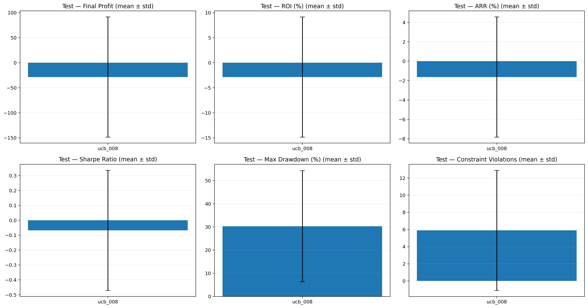
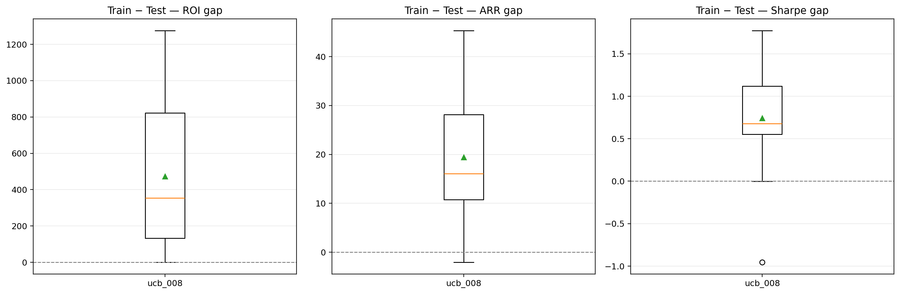
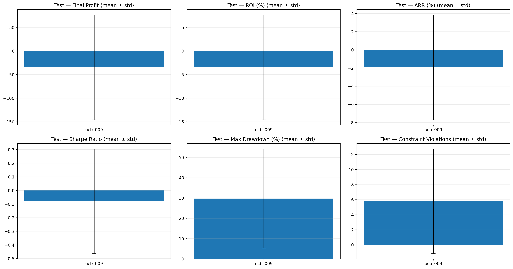
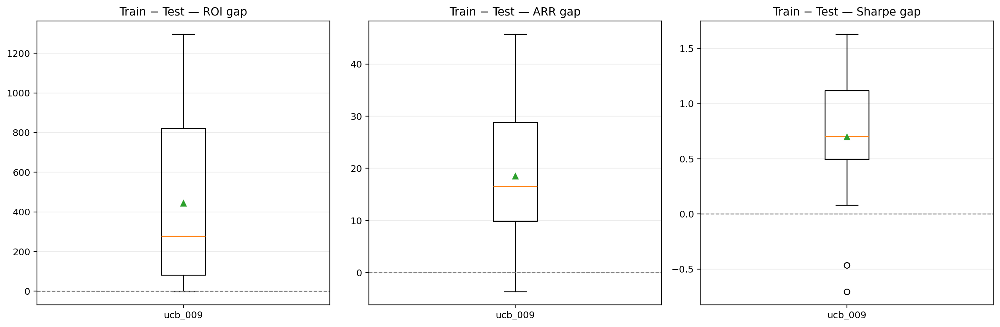
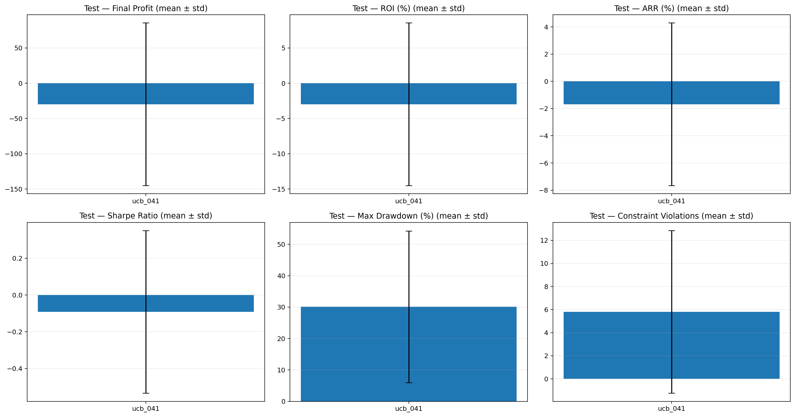
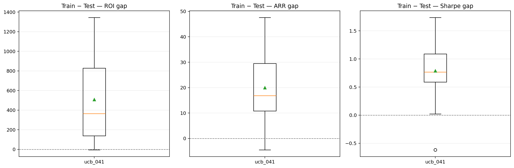
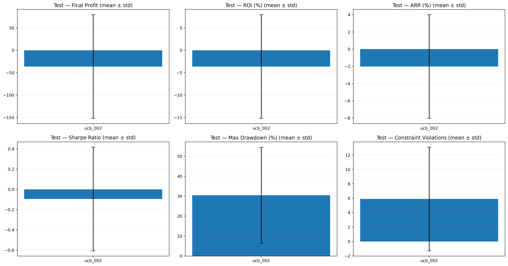
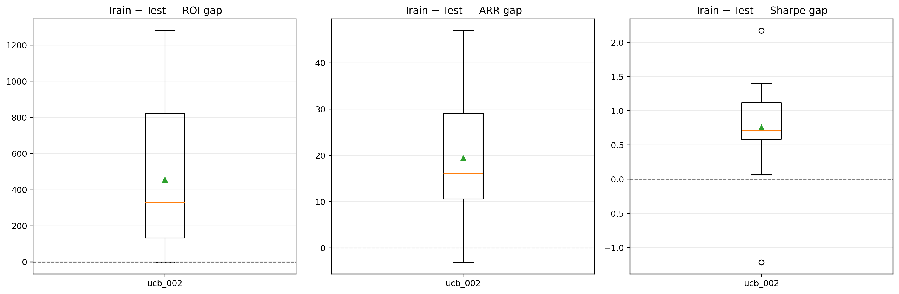
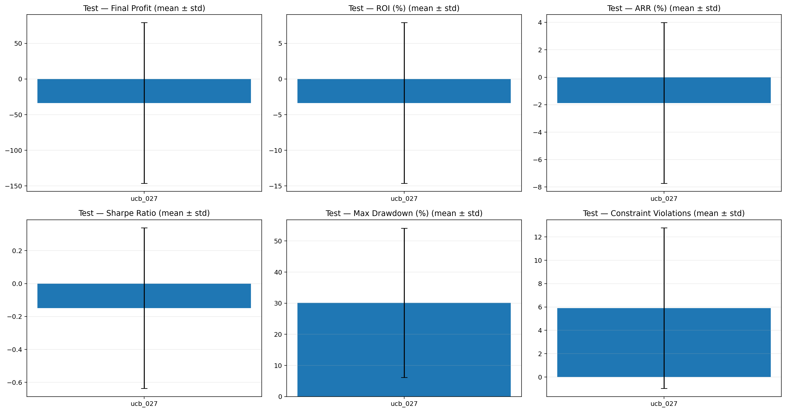
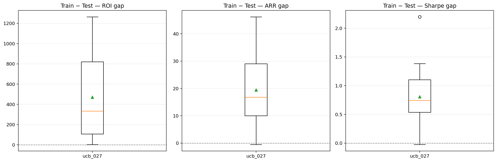

# Báo cáo tổng hợp Top 5 UCB trên 20 seed độc lập

## 1. Phạm vi và tính đầy đủ của dữ liệu

Báo cáo tổng hợp năm cấu hình UCB trong `application/EIDT_Project/Top5_ucb`. Mỗi cấu hình được huấn luyện và đánh giá độc lập trên 20 seed từ 45 đến 64.

| Cấu hình | Số dòng metrics | Số seed độc lập | Miền seed | Finite rate |
|---|---:|---:|---|---:|
| `ucb_002` | 20 | 20 | 45–64 | 100% |
| `ucb_008` | 20 | 20 | 45–64 | 100% |
| `ucb_009` | 20 | 20 | 45–64 | 100% |
| `ucb_027` | 20 | 20 | 45–64 | 100% |
| `ucb_041` | 20 | 20 | 45–64 | 100% |

Tổng cộng có **100 lượt chạy hoàn chỉnh**. Không có seed thiếu và không có kết quả NaN/Inf.

VAE được cố định là `vae_019` (`latent_dim = 16`, `vae_lr = 0.0001`, `beta_kl = 0.05`) trong cả năm thí nghiệm. Vì vậy, khác biệt giữa các kết quả chủ yếu đến từ tham số UCB và seed.

## 2. Năm cấu hình được so sánh

| Cấu hình | `beta_0` | `beta_decay` | `beta_min` |
|---|---:|---:|---:|
| `ucb_002` | 0.01 | 0.93 | 0.005 |
| `ucb_009` | 0.03 | 0.90 | 0.010 |
| `ucb_008` | 0.03 | 0.90 | 0.005 |
| `ucb_041` | 0.30 | 0.90 | 0.010 |
| `ucb_027` | 0.10 | 0.93 | 0.010 |

## 3. Kết quả trên tập test

### Trung bình ± độ lệch chuẩn trên 20 seed

| Xếp hạng tham khảo | Cấu hình | Test Profit | Test ROI (%) | Test ARR (%) | Test Sharpe | Test MDD (%) | Violations |
|---:|---|---:|---:|---:|---:|---:|---:|
| **1** | **`ucb_008`** | **-28,51 ± 119,96** | **-2,85 ± 12,00** | **-1,63 ± 6,19** | **-0,0677 ± 0,4032** | 30,32 ± 23,99 | 5,90 ± 7,00 |
| **2** | **`ucb_009`** | -34,41 ± 111,17 | -3,44 ± 11,12 | -1,91 ± 5,77 | -0,0787 ± **0,3854** | **29,77 ± 24,41** | **5,80 ± 6,96** |
| **3** | **`ucb_041`** | -29,82 ± 115,24 | -2,98 ± 11,52 | -1,69 ± 5,98 | -0,0918 ± 0,4426 | 30,09 ± 24,16 | **5,80 ± 7,05** |
| **4** | **`ucb_002`** | -36,13 ± 115,97 | -3,61 ± 11,60 | -2,01 ± 6,03 | -0,0946 ± 0,5118 | 30,46 ± 24,05 | 5,90 ± 7,20 |
| **5** | **`ucb_027`** | -33,66 ± 112,75 | -3,37 ± 11,27 | -1,88 ± 5,86 | -0,1492 ± 0,4880 | 30,11 ± 24,00 | 5,90 ± 6,88 |

Thứ hạng trên ưu tiên kết quả test ngoài mẫu, đặc biệt là Sharpe, ROI/ARR, độ phân tán và MDD. Đây không phải score tuning cũ.

Các kết luận trực tiếp:

- **Không cấu hình nào có Profit, ROI, ARR hoặc Sharpe test trung bình dương.**
- `ucb_008` có Profit, ROI, ARR và Sharpe trung bình tốt nhất, nhưng các giá trị trung bình vẫn âm.
- `ucb_009` có độ lệch chuẩn Sharpe thấp nhất, MDD trung bình thấp nhất, violations thấp nhất và generalization gap nhỏ nhất.
- Độ lệch chuẩn ROI khoảng 11–12% và MDD khoảng 24% cho thấy kết quả rất nhạy với seed.

## 4. Độ ổn định và kết quả theo seed

| Cấu hình | ROI trung vị (%) | ROI nhỏ nhất (%) | ROI lớn nhất (%) | Seed ROI > 0 | Sharpe trung vị | Seed Sharpe > 0 | Sharpe std |
|---|---:|---:|---:|---:|---:|---:|---:|
| `ucb_008` | -2,05 | -21,91 | **14,79** | **10/20** | -0,0602 | **9/20** | 0,4032 |
| `ucb_009` | -2,13 | -22,27 | 12,24 | **10/20** | -0,0526 | 8/20 | **0,3854** |
| `ucb_041` | **0,03** | -24,63 | 12,59 | **10/20** | **-0,0302** | **9/20** | 0,4426 |
| `ucb_002` | -2,88 | -24,73 | 12,24 | 9/20 | -0,0602 | **9/20** | 0,5118 |
| `ucb_027` | -2,72 | -23,72 | 12,24 | 9/20 | -0,0808 | 7/20 | 0,4880 |

`ucb_041` là cấu hình duy nhất có ROI trung vị hơi dương, nhưng mức 0,03% gần như hòa vốn và ROI trung bình vẫn âm. Sự khác biệt giữa trung bình và trung vị cho thấy phân phối bị ảnh hưởng bởi các seed thua lỗ mạnh.

Khoảng tin cậy 95% gần đúng của trung bình:

| Cấu hình | Test ROI trung bình | CI 95% ROI | Test Sharpe trung bình | CI 95% Sharpe |
|---|---:|---:|---:|---:|
| `ucb_008` | -2,85 | [-8,46; 2,76] | -0,0677 | [-0,2564; 0,1211] |
| `ucb_009` | -3,44 | [-8,64; 1,76] | -0,0787 | [-0,2590; 0,1017] |
| `ucb_041` | -2,98 | [-8,38; 2,41] | -0,0918 | [-0,2990; 0,1153] |
| `ucb_002` | -3,61 | [-9,04; 1,81] | -0,0946 | [-0,3341; 0,1450] |
| `ucb_027` | -3,37 | [-8,64; 1,91] | -0,1492 | [-0,3776; 0,0791] |

Tất cả khoảng tin cậy đều chứa 0. Với 20 seed hiện tại, chưa có bằng chứng thống kê rằng lợi nhuận hoặc Sharpe kỳ vọng của bất kỳ cấu hình nào dương.

## 5. Phân tích generalization gap và overfit

| Cấu hình | Train ROI (%) | Test ROI (%) | Gap ROI | Train ARR (%) | Test ARR (%) | Gap ARR | Train Sharpe | Test Sharpe | Gap Sharpe |
|---|---:|---:|---:|---:|---:|---:|---:|---:|---:|
| `ucb_009` | 439,95 | -3,44 | **443,39** | 16,61 | -1,91 | **18,52** | 0,6195 | -0,0787 | **0,6982** |
| `ucb_008` | 469,57 | -2,85 | 472,42 | 17,78 | -1,63 | 19,41 | 0,6738 | -0,0677 | 0,7414 |
| `ucb_002` | 452,33 | -3,61 | 455,94 | 17,39 | -2,01 | 19,41 | 0,6623 | -0,0946 | 0,7569 |
| `ucb_041` | **504,80** | -2,98 | **507,78** | **18,29** | -1,69 | **19,97** | **0,6963** | -0,0918 | 0,7881 |
| `ucb_027` | 467,56 | -3,37 | 470,93 | 17,59 | -1,88 | 19,47 | 0,6579 | -0,1492 | **0,8071** |

Dấu hiệu overfit rõ ràng ở cả năm cấu hình:

1. Train ROI trung bình đạt 440–505%, trong khi test ROI trung bình từ -2,85% đến -3,61%.
2. Train Sharpe dương 0,62–0,70, trong khi test Sharpe trung bình âm.
3. Gap ROI và gap Sharpe đều dương rất lớn trên toàn bộ cấu hình.
4. `ucb_009` có gap nhỏ nhất trên ROI, ARR và Sharpe; đây là lựa chọn có khả năng khái quát hóa tương đối tốt nhất, dù hiệu suất test vẫn chưa đạt yêu cầu.
5. `ucb_041` đạt train metrics cao nhất nhưng có gap ROI và ARR lớn nhất. Kết quả này là dấu hiệu điển hình của việc tối ưu tốt trên train nhưng không chuyển hóa thành hiệu suất test.
6. `ucb_027` có gap Sharpe lớn nhất và Test Sharpe thấp nhất, nên là cấu hình yếu nhất về lợi nhuận điều chỉnh rủi ro ngoài mẫu.

### Diễn biến theo episode

| Cấu hình | Test Sharpe episode 1 | Test Sharpe tốt nhất | Episode tốt nhất | Test Sharpe episode 45 | Train Sharpe episode 45 |
|---|---:|---:|---:|---:|---:|
| `ucb_002` | -3,3205 | -0,0946 | 45 | -0,0946 | 0,6623 |
| `ucb_008` | -3,3232 | **-0,0598** | 44 | -0,0677 | 0,6738 |
| `ucb_009` | -3,3232 | -0,0787 | 45 | -0,0787 | 0,6195 |
| `ucb_027` | -3,3237 | -0,1492 | 45 | -0,1492 | 0,6579 |
| `ucb_041` | -3,2804 | -0,0874 | 42 | -0,0918 | **0,6963** |

Test Sharpe cải thiện mạnh trong quá trình huấn luyện, nên mô hình vẫn học được tín hiệu có ích. Tuy nhiên, test Sharpe cuối cùng vẫn âm và cách xa train Sharpe. `ucb_008` giảm nhẹ sau episode 44 và `ucb_041` giảm nhẹ sau episode 42; mức giảm nhỏ, nhưng có thể kiểm tra early stopping trong thí nghiệm tiếp theo. Vấn đề chính vẫn là generalization gap mang tính cấu trúc, không chỉ là suy giảm ở vài episode cuối.

## 6. So sánh trực tiếp giữa các cấu hình

Hiệu suất của năm cấu hình tương quan rất cao theo seed. Tương quan Test Sharpe giữa `ucb_008` và `ucb_009` là 0,961; giữa `ucb_008` và `ucb_002` là 0,928. Điều này cho thấy seed và điều kiện thị trường ảnh hưởng mạnh hơn chênh lệch nhỏ giữa các bộ tham số UCB.

So sánh ghép cặp `ucb_008` với các cấu hình khác trên cùng 20 seed:

| So sánh | Chênh lệch ROI TB | CI 95% chênh lệch ROI | Chênh lệch Sharpe TB | CI 95% chênh lệch Sharpe |
|---|---:|---:|---:|---:|
| `ucb_008 - ucb_002` | 0,76 | [-0,55; 2,08] | 0,0269 | [-0,0685; 0,1223] |
| `ucb_008 - ucb_009` | 0,59 | [-0,20; 1,38] | 0,0110 | [-0,0412; 0,0633] |
| `ucb_008 - ucb_027` | 0,52 | [-0,43; 1,46] | 0,0816 | [-0,0510; 0,2142] |
| `ucb_008 - ucb_041` | 0,13 | [-1,43; 1,70] | 0,0241 | [-0,0676; 0,1158] |

Tất cả CI ghép cặp đều chứa 0. Vì vậy, `ucb_008` đứng đầu về giá trị trung bình nhưng chưa thể khẳng định vượt trội có ý nghĩa thống kê so với bốn cấu hình còn lại.

## 7. Nhận xét theo từng cấu hình

### `ucb_008` — tốt nhất theo hiệu suất test trung bình

- Đứng đầu về Test Profit, ROI, ARR và Sharpe trung bình.
- Có 10/20 seed sinh lời và 9/20 seed Sharpe dương.
- Sharpe std thấp thứ hai, chỉ sau `ucb_009`.
- Vẫn có ROI trung vị âm và gap train–test lớn.
- Phù hợp làm **ứng viên hiệu suất chính**, nhưng chưa đủ bằng chứng để triển khai thực tế.

### `ucb_009` — tốt nhất về độ ổn định và khái quát hóa tương đối

- Sharpe std thấp nhất, MDD trung bình thấp nhất và violations thấp nhất (đồng hạng với `ucb_041`).
- Có gap ROI, ARR và Sharpe nhỏ nhất trong năm cấu hình.
- Test Sharpe trung bình đứng thứ hai, nhưng Test ROI/ARR thấp hơn `ucb_008` và `ucb_041`.
- Phù hợp làm **ứng viên thận trọng** nếu ưu tiên ổn định hơn lợi nhuận trung bình.

### `ucb_041` — train mạnh nhưng overfit cao

- Train Profit, ROI, ARR và Sharpe cao nhất.
- ROI trung vị test hơi dương và 10/20 seed sinh lời.
- Gap ROI và ARR lớn nhất, cho thấy hiệu suất train cao không khái quát tốt.
- Có thể phù hợp để nghiên cứu regularization hoặc early stopping, nhưng không nên chọn chỉ dựa vào train metrics.

### `ucb_002` — lựa chọn screening không được xác nhận trên 20 seed mới

- Từng đứng đầu score ở vòng screening ba seed nhưng có Test Profit/ROI trung bình thấp nhất trong vòng 20 seed.
- Sharpe std cao nhất, thể hiện độ nhạy seed lớn.
- Kết quả minh họa rõ rủi ro của việc chọn cấu hình từ chỉ ba seed screening.

### `ucb_027` — yếu nhất về Sharpe ngoài mẫu

- Test Sharpe trung bình thấp nhất và chỉ 7/20 seed có Sharpe dương.
- Gap Sharpe lớn nhất.
- Không có lợi thế rõ ràng về MDD hoặc violations để bù lại hiệu suất thấp.

## 8. Biểu đồ kết quả

### `ucb_008`

### `ucb_009`

### `ucb_041`

### `ucb_002`

### `ucb_027`

## 9. Kết luận và khuyến nghị

### Kết luận

1. **`ucb_008` là cấu hình tốt nhất theo hiệu suất test trung bình.**
2. **`ucb_009` là cấu hình tốt nhất nếu ưu tiên độ ổn định, rủi ro và generalization gap.**
3. `ucb_041` đứng thứ ba nhờ kết quả test tương đối tốt, nhưng có dấu hiệu overfit mạnh nhất về ROI/ARR.
4. `ucb_002` không tái lập được vị trí số một từ vòng screening ba seed.
5. `ucb_027` yếu nhất về Test Sharpe và gap Sharpe.
6. Quan trọng nhất: **chưa có cấu hình nào chứng minh được hiệu suất ngoài mẫu dương hoặc ổn định**. Không nên chọn cấu hình cuối cùng chỉ dựa vào thứ hạng tương đối trong nhóm này.

### Khuyến nghị tiếp theo

- Giữ `ucb_008` và `ucb_009` cho vòng nghiên cứu tiếp theo; loại hoặc giảm ưu tiên ba cấu hình còn lại.
- Thử early stopping quanh episode 42–44, đặc biệt cho `ucb_008` và `ucb_041`, nhưng phải chọn điểm dừng bằng validation chứ không dùng test.
- Tăng regularization hoặc giảm khả năng mô hình học thuộc train; cân nhắc giảm số episode và kiểm tra walk-forward validation.
- Báo cáo thêm benchmark buy-and-hold và epsilon-greedy trên đúng 20 seed/chu kỳ test để biết hiệu suất âm đến từ mô hình hay từ giai đoạn thị trường.
- Không tiếp tục tinh chỉnh trực tiếp trên tập test hiện tại; giữ một tập holdout cuối cùng hoặc dùng nested/walk-forward validation để tránh rò rỉ lựa chọn mô hình.

## 10. Nguồn dữ liệu

Mỗi thư mục cấu hình cung cấp:

- `*_20seed_metrics.csv`: metrics train/test và gap theo từng seed.
- `*_20seed_summary.csv`: mean và std trên 20 seed.
- `*_episode_curves.csv`: diễn biến train/test theo episode.
- `*_losses.csv`: Q/VAE/Cost loss.
- `*_20seed_report.json`: cấu hình chạy và thống kê tổng hợp.
- Các biểu đồ test distribution, overfit gap, train–test scatter và loss convergence.

