# Battle of 3 Variants — Báo cáo tổng hợp

## 1. Thiết lập thực nghiệm

- Dữ liệu: HPG BAD, train 2013–2021 và test 2022–2023.
- Số lần chạy: 20 seed độc lập, từ seed 44 đến 63.
- Số episode: 45 cho mỗi seed.
- Enhanced UCB-VAE: khóa cứng `beta_0 = 0.03`.
- Uncertainty-Aware UCB-VAE: khóa cứng `beta_0 = 0.03`.
- Epsilon-Greedy: `epsilon_init = 1.0`, `epsilon_decay = 0.95`, `epsilon_min = 0.05`.
- Cả ba phương pháp dùng cùng Frozen Scaler, môi trường, phí giao dịch và reward shaping cải tiến.

Nguồn tổng hợp chính là các file `battle_*_metrics_export.csv`. Mỗi file đã được kiểm tra chứa đúng 20 seed 44–63. Riêng `enhanced/battle_enhanced_metrics.csv` chỉ có một seed, vì vậy báo cáo không sử dụng file thiếu này mà sử dụng `battle_enhanced_metrics_export.csv` đầy đủ.

## 2. Kết quả tổng hợp

| Model | Profit | ROI (%) | ARR (%) | Sharpe | Max Drawdown (%) | Violations | Seed có profit dương |
|---|---:|---:|---:|---:|---:|---:|---:|
| Enhanced UCB-VAE | -35.741 ± 117.590 | -3.574 ± 11.759 | -1.999 ± 6.146 | -0.150 ± 0.638 | 30.001 ± 23.205 | 5.40 ± 6.15 | 10/20 |
| Uncertainty-Aware UCB-VAE | -19.788 ± 95.427 | -1.979 ± 9.543 | -1.118 ± 4.934 | **-0.113 ± 0.641** | **29.210 ± 22.507** | 4.90 ± 5.67 | **11/20** |
| Epsilon-Greedy | **-11.462 ± 97.666** | **-1.146 ± 9.767** | **-0.699 ± 5.037** | -0.266 ± 1.023 | 29.936 ± 21.727 | **4.70 ± 5.33** | 10/20 |

Giá trị được trình bày dưới dạng mean ± sample standard deviation. Chữ đậm biểu thị giá trị tốt nhất theo từng tiêu chí; với Max Drawdown và Violations, giá trị thấp hơn tốt hơn.

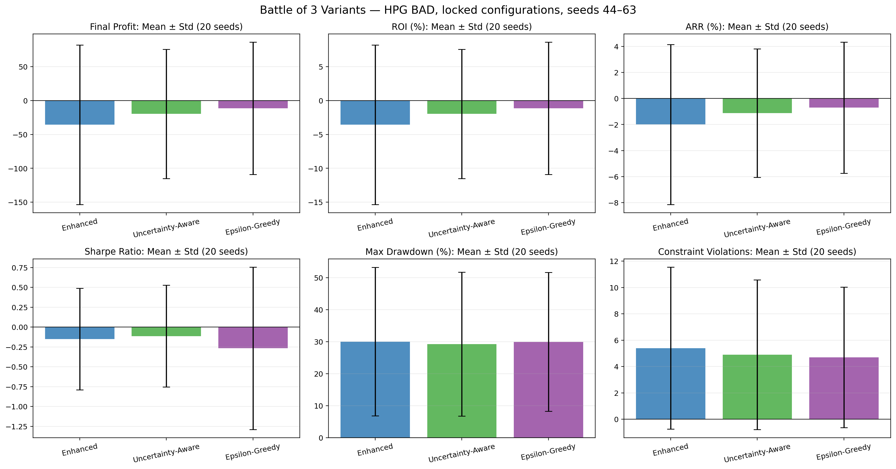

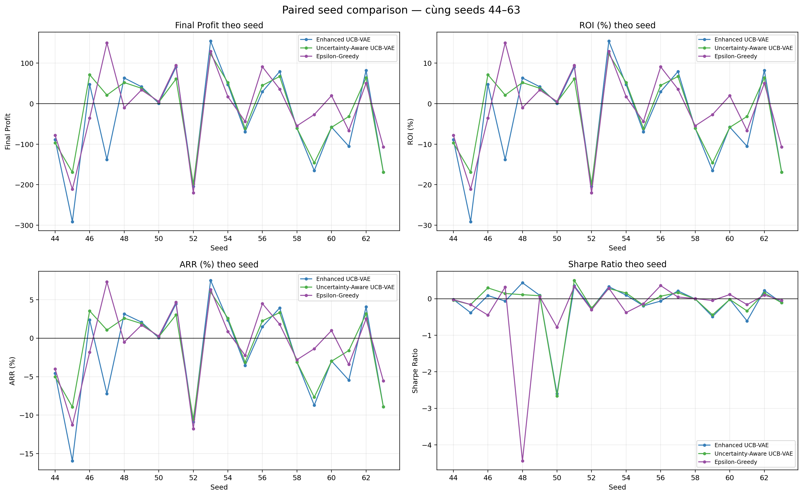

## 3. Đánh giá chung

Không mô hình nào tạo được lợi nhuận trung bình dương trên giai đoạn test HPG BAD. Độ lệch chuẩn của Profit, ROI, ARR và Sharpe đều lớn so với giá trị trung bình, cho thấy kết quả phụ thuộc mạnh vào seed và chính sách chưa ổn định.

- **Epsilon-Greedy** có Profit, ROI và ARR trung bình tốt nhất, đồng thời có số vi phạm trung bình thấp nhất. Tuy nhiên Sharpe trung bình thấp nhất và độ lệch chuẩn Sharpe lớn nhất (`1.023`), cho thấy kết quả điều chỉnh theo rủi ro thiếu ổn định.
- **Uncertainty-Aware UCB-VAE** có Sharpe trung bình tốt nhất, Max Drawdown trung bình thấp nhất, độ lệch chuẩn Profit thấp nhất và nhiều seed sinh lời nhất (`11/20`). Đây là phương pháp cân bằng rủi ro tốt nhất trong ba phương pháp, nhưng lợi nhuận trung bình vẫn âm.
- **Enhanced UCB-VAE** có Profit/ROI/ARR trung bình thấp nhất và variance Profit lớn nhất. Trong thử nghiệm này, chỉ riêng các cải tiến regularization, reward shaping và UCB-VAE chưa tạo ra lợi thế ổn định trên test.

Thứ hạng phụ thuộc mục tiêu:

| Mục tiêu | Hạng 1 | Hạng 2 | Hạng 3 |
|---|---|---|---|
| Profit / ROI / ARR trung bình | Epsilon-Greedy | Uncertainty-Aware | Enhanced |
| Sharpe trung bình | Uncertainty-Aware | Enhanced | Epsilon-Greedy |
| Max Drawdown thấp | Uncertainty-Aware | Epsilon-Greedy | Enhanced |
| Ít violations | Epsilon-Greedy | Uncertainty-Aware | Enhanced |
| Độ ổn định Profit | Uncertainty-Aware | Epsilon-Greedy | Enhanced |

Kết luận thận trọng: Cost Network giúp Uncertainty-Aware cải thiện độ ổn định và các chỉ tiêu điều chỉnh theo rủi ro so với Enhanced, nhưng chưa đủ để biến lợi nhuận trung bình thành dương. Epsilon-Greedy đạt lợi nhuận trung bình ít âm nhất nhưng có rủi ro bất ổn rõ rệt qua Sharpe.

## 4. Enhanced UCB-VAE

### Thống kê

| Chỉ tiêu | Mean | Std | Median |
|---|---:|---:|---:|
| Final Profit | -35.741 | 117.590 | -28.613 |
| ROI (%) | -3.574 | 11.759 | -2.861 |
| ARR (%) | -1.999 | 6.146 | -1.465 |
| Sharpe Ratio | -0.150 | 0.638 | -0.020 |
| Max Drawdown (%) | 30.001 | 23.205 | 29.188 |
| Constraint Violations | 5.40 | 6.15 | 2.00 |

- Seed có Profit tốt nhất: seed 53, Profit `154.092`.
- Seed có Profit thấp nhất: seed 45, Profit `-291.225`.
- Seed có Sharpe tốt nhất: seed 48, Sharpe `0.435`.
- Số seed có Profit dương: `10/20`.

### Hình ảnh

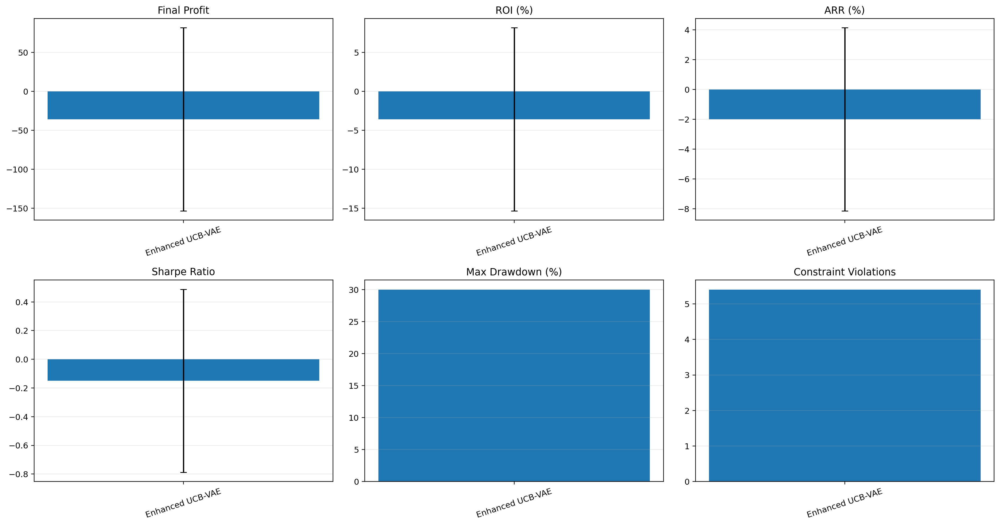

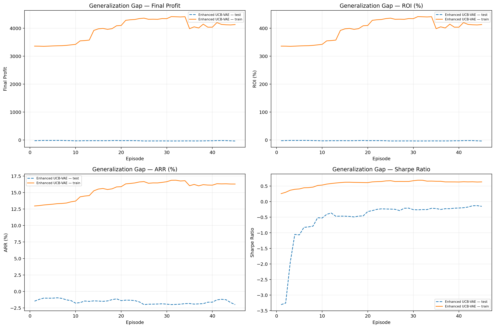

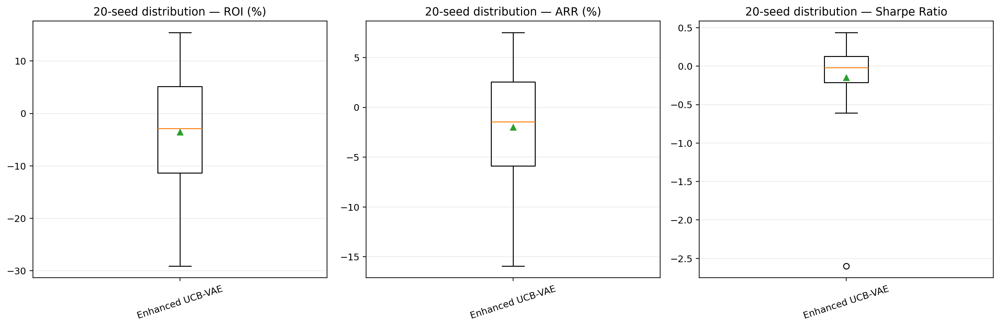

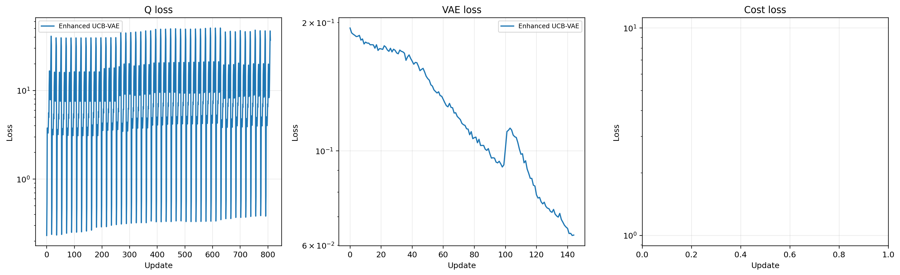

## 5. Uncertainty-Aware UCB-VAE

### Thống kê

| Chỉ tiêu | Mean | Std | Median |
|---|---:|---:|---:|
| Final Profit | -19.788 | 95.427 | 12.239 |
| ROI (%) | -1.979 | 9.543 | 1.224 |
| ARR (%) | -1.118 | 4.934 | 0.615 |
| Sharpe Ratio | -0.113 | 0.641 | 0.030 |
| Max Drawdown (%) | 29.210 | 22.507 | 28.733 |
| Constraint Violations | 4.90 | 5.67 | 2.00 |

- Seed có Profit tốt nhất: seed 53, Profit `122.441`.
- Seed có Profit thấp nhất: seed 52, Profit `-198.267`.
- Seed có Sharpe tốt nhất: seed 51, Sharpe `0.501`.
- Số seed có Profit dương: `11/20`.

### Hình ảnh

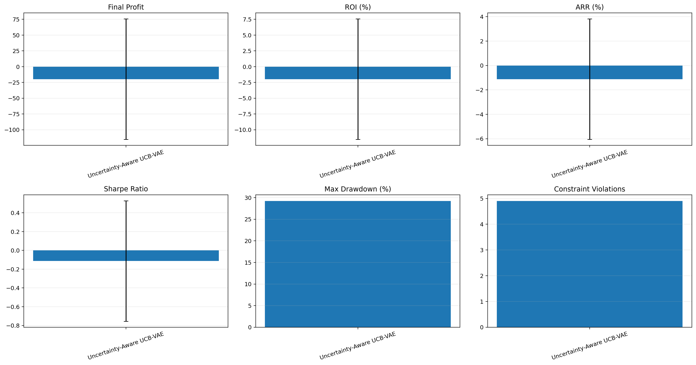

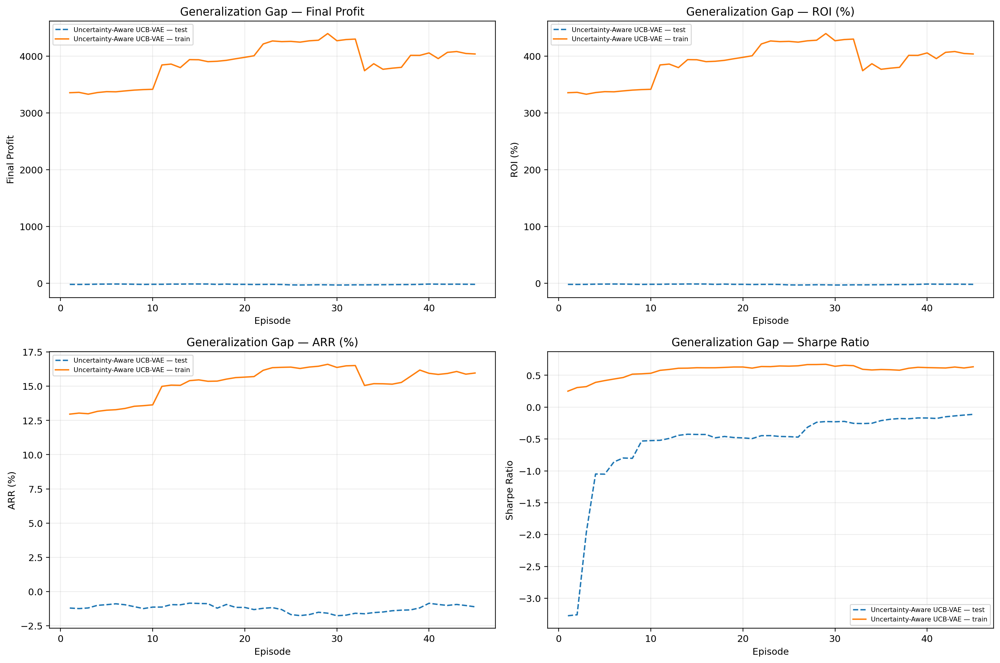

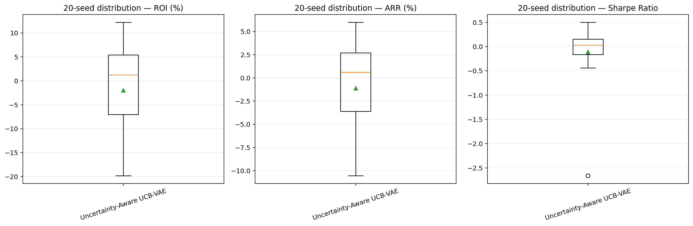

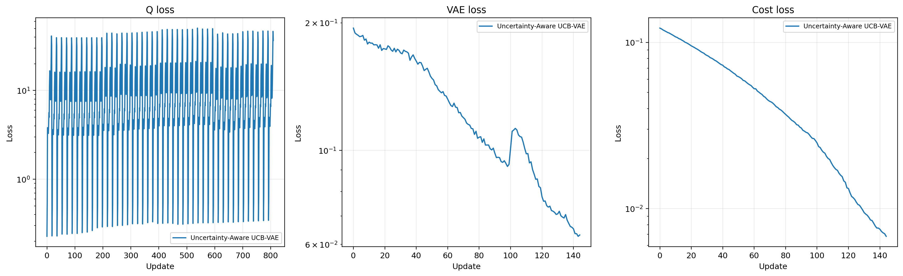

## 6. Epsilon-Greedy

### Thống kê

| Chỉ tiêu | Mean | Std | Median |
|---|---:|---:|---:|
| Final Profit | -11.462 | 97.666 | -2.449 |
| ROI (%) | -1.146 | 9.767 | -0.245 |
| ARR (%) | -0.699 | 5.037 | -0.124 |
| Sharpe Ratio | -0.266 | 1.023 | -0.036 |
| Max Drawdown (%) | 29.936 | 21.727 | 30.790 |
| Constraint Violations | 4.70 | 5.33 | 2.50 |

- Seed có Profit tốt nhất: seed 47, Profit `149.919`.
- Seed có Profit thấp nhất: seed 52, Profit `-219.874`.
- Seed có Sharpe tốt nhất: seed 56, Sharpe `0.358`.
- Số seed có Profit dương: `10/20`.

### Hình ảnh

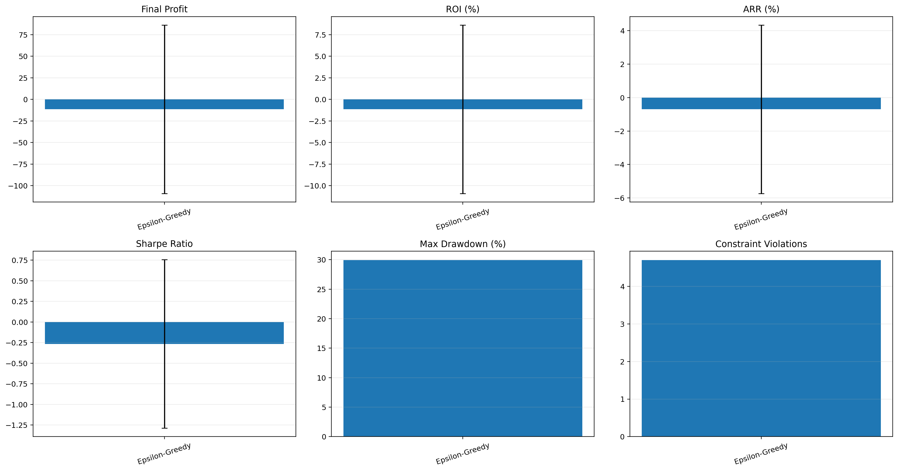

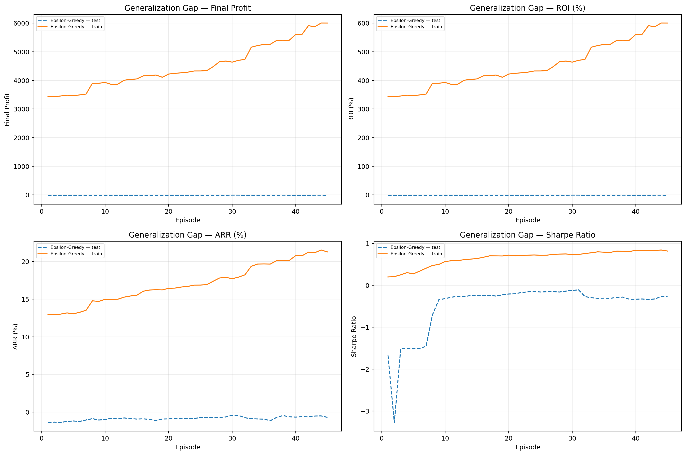

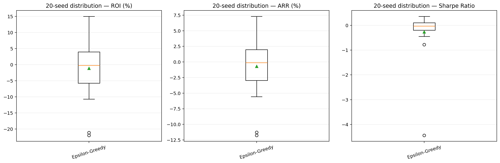

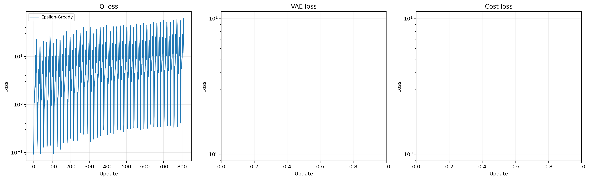

## 7. Lưu ý khi diễn giải

1. Train kéo dài 2013–2021 trong khi test chỉ gồm 2022–2023. Generalization Gap theo Profit tuyệt đối bị ảnh hưởng bởi độ dài hai giai đoạn; ROI, ARR và Sharpe phù hợp hơn để đánh giá overfitting.
2. Trung bình âm nhưng median của Uncertainty-Aware dương cho thấy một số seed thua lỗ lớn đang kéo mean xuống. Vì vậy cần xem đồng thời mean, median, std và đồ thị từng seed.
3. Kết quả sử dụng cùng 20 seed nên có thể thực hiện kiểm định ghép cặp giữa các mô hình trong phân tích tiếp theo.
4. Các kết quả chỉ phản ánh HPG BAD và cấu hình khóa cứng hiện tại; không nên khái quát sang cổ phiếu hoặc chế độ thị trường khác nếu chưa kiểm nghiệm thêm.

## 8. File dữ liệu nguồn

- [Enhanced metrics](enhanced/battle_enhanced_metrics_export.csv)
- [Uncertainty-Aware metrics](uncertainty_aware/battle_uncertainty_aware_metrics_export.csv)
- [Epsilon-Greedy metrics](epsilon_greedy/battle_epsilon_greedy_metrics_export.csv)
- [Enhanced report JSON](enhanced/battle_enhanced_report.json)
- [Uncertainty-Aware report JSON](uncertainty_aware/battle_uncertainty_aware_report.json)
- [Epsilon-Greedy report JSON](epsilon_greedy/battle_epsilon_greedy_report.json)
