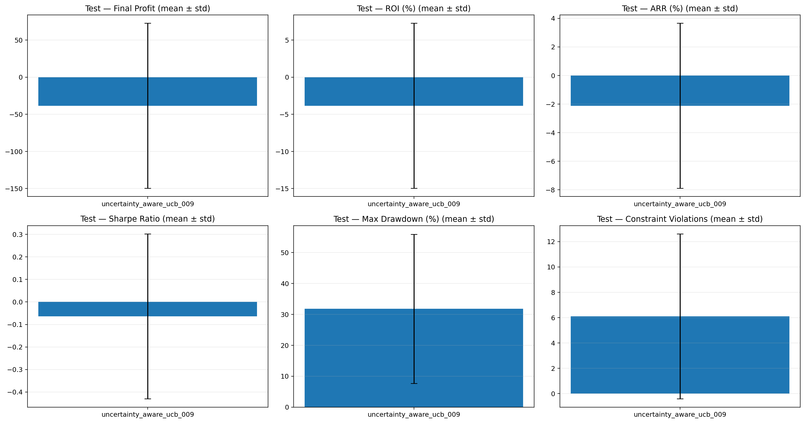
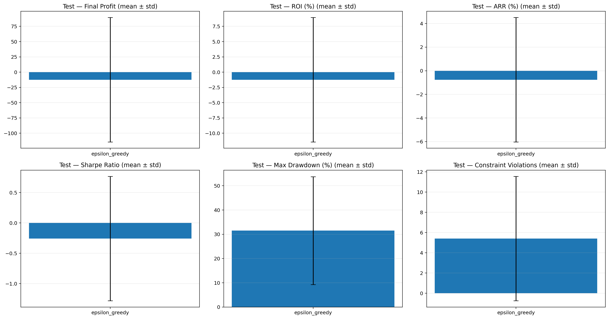
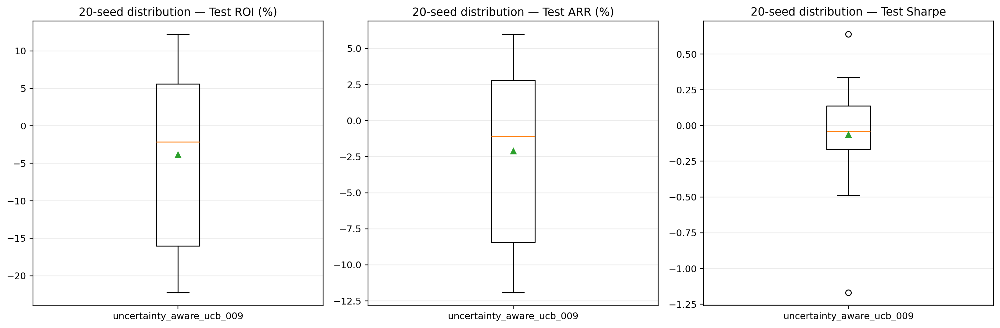
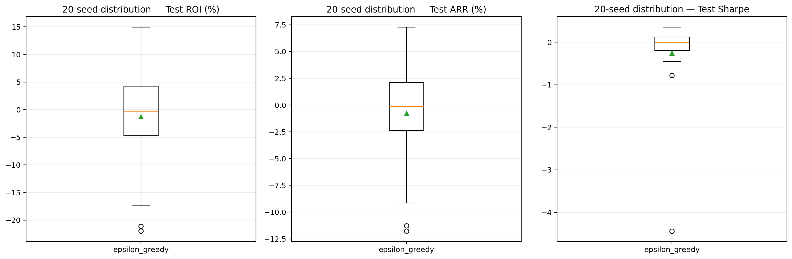
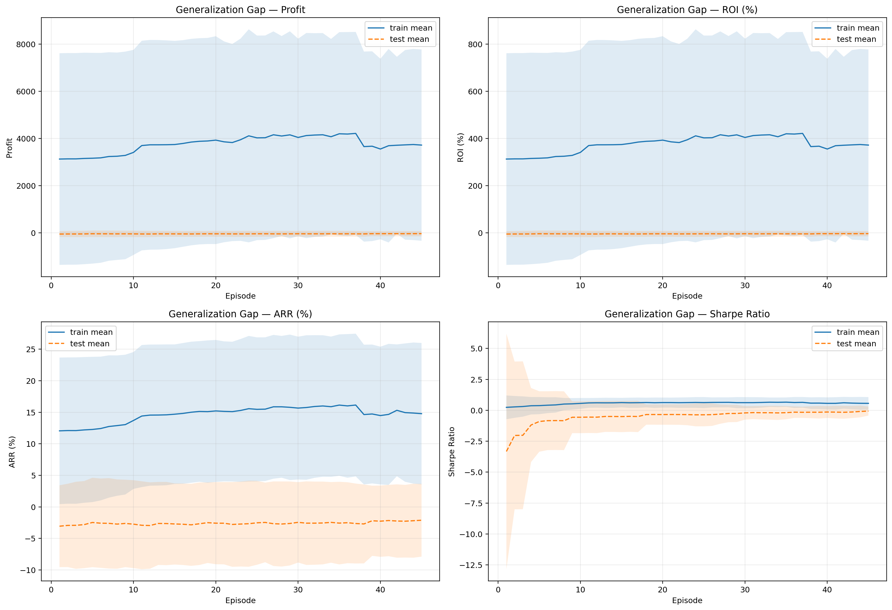
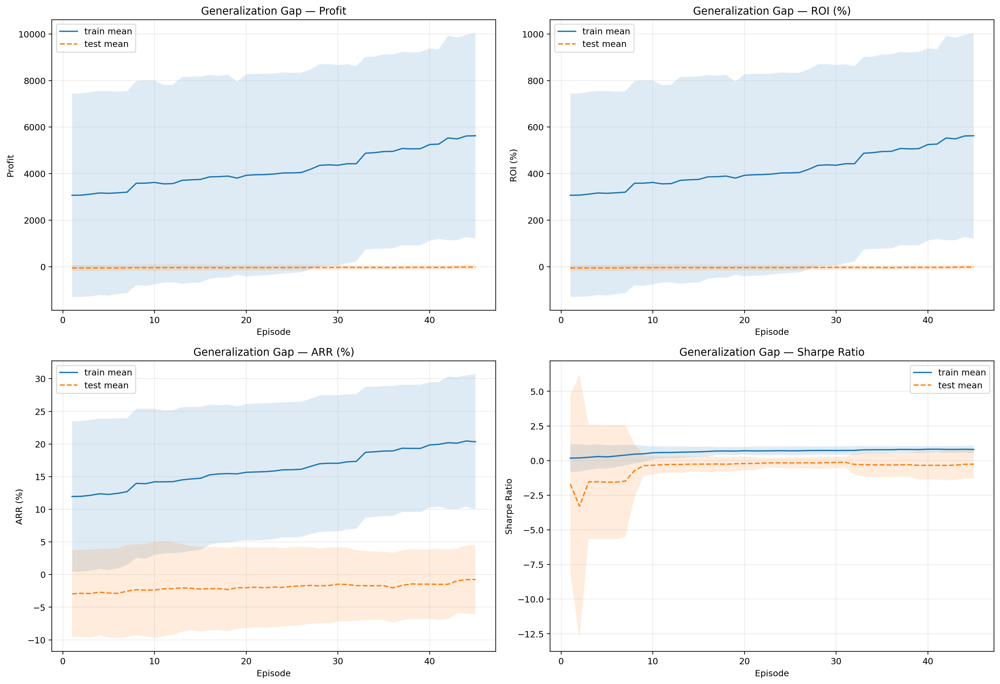
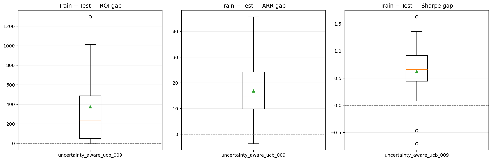
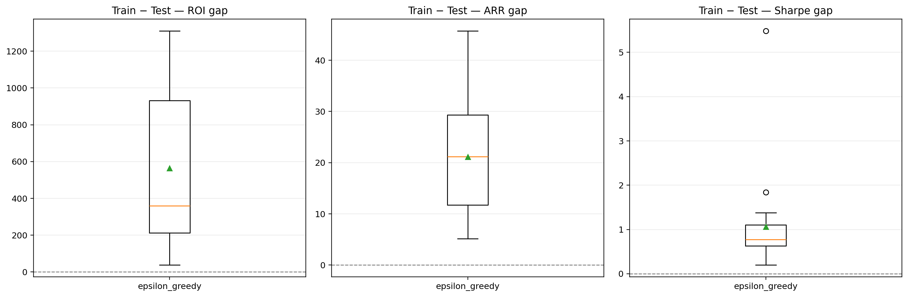

# BÁO CÁO SO SÁNH UCB-VAE VÀ EPSILON-GREEDY TRÊN 20 SEED

## 1. Mục tiêu và phạm vi

Báo cáo này tổng hợp kết quả của hai chiến lược:

1. **Uncertainty-Aware UCB-VAE** dùng `vae_019 + ucb_009`.
2. **Epsilon-Greedy** theo cấu hình Battle.

Hai mô hình được đánh giá độc lập trên cùng 20 seed từ **41 đến 60**, cùng dữ liệu HPG, cùng 45 episode và cùng quy trình train/test. Các thống kê trong báo cáo được tính lại trực tiếp từ hai file `20seed_metrics.csv`.

Tính toàn vẹn của kết quả:

- Mỗi mô hình có đủ 20 seed: `41, 42, ..., 60`.
- Hai mô hình có cùng tập seed nên có thể so sánh theo cặp trên từng seed.
- Tất cả 40 lượt chạy đều có kết quả hữu hạn (`finite = True`).
- Không có seed bị thiếu hoặc bị lặp.

## 2. Cấu hình và dữ liệu chung

- Tài sản: cổ phiếu HPG, bộ dữ liệu BAD.
- Train: 02/01/2013–31/12/2021, 2.248 quan sát.
- Test: 04/01/2022–29/12/2023, 498 quan sát.
- Số episode: 45.
- Vốn ban đầu: 1.000.
- Phí giao dịch: 0,1%.
- State: `close, cash, position, MACD, RSI, CCI, ADX`.
- Scaler chỉ được fit trên train nhằm tránh rò rỉ dữ liệu test.

Cấu hình UCB-VAE sử dụng latent dimension 16, VAE learning rate `1e-4`, beta KL `0.05` và UCB với `beta_0 = 0.03`, `beta_decay = 0.90`, `beta_min = 0.01`. Epsilon-Greedy sử dụng `epsilon_init = 1.0`, `epsilon_decay = 0.95`, `epsilon_min = 0.05`.

## 3. Kết quả cuối trên tập test

Giá trị được trình bày dưới dạng **trung bình ± độ lệch chuẩn** trên 20 seed.

| Chỉ số test | UCB-VAE (`vae_019 + ucb_009`) | Epsilon-Greedy | Nhận xét |
|---|---:|---:|---|
| Profit | -38,42 ± 111,16 | **-12,48 ± 101,94** | Epsilon-Greedy tốt hơn 25,95 đơn vị vốn |
| ROI (%) | -3,84 ± 11,12 | **-1,25 ± 10,19** | Epsilon-Greedy ít âm hơn 2,59 điểm % |
| ARR (%) | -2,12 ± 5,77 | **-0,76 ± 5,27** | Epsilon-Greedy tốt hơn 1,35 điểm % |
| Sharpe | **-0,064 ± 0,366** | -0,257 ± 1,025 | Trung bình UCB cao hơn, nhưng bị ảnh hưởng bởi ngoại lệ của Epsilon-Greedy |
| Max drawdown (%) | 31,80 ± 24,13 | **31,49 ± 22,25** | Gần như tương đương |
| Constraint violations | 6,10 ± 6,51 | **5,40 ± 6,15** | Epsilon-Greedy ít hơn nhẹ |

Trung vị cung cấp góc nhìn ít nhạy với ngoại lệ hơn:

| Chỉ số test | Trung vị UCB-VAE | Trung vị Epsilon-Greedy |
|---|---:|---:|
| Profit | -21,32 | **-2,45** |
| ROI (%) | -2,13 | **-0,24** |
| ARR (%) | -1,09 | **-0,12** |
| Sharpe | -0,041 | **-0,011** |
| Max drawdown (%) | 32,66 | **30,79** |
| Constraint violations | 2,50 | 2,50 |

## 4. So sánh theo cặp trên cùng seed

| Tiêu chí | UCB-VAE thắng | Epsilon-Greedy thắng | Hòa |
|---|---:|---:|---:|
| Test Profit/ROI/ARR | 8 | **12** | 0 |
| Test Sharpe | 8 | **12** | 0 |
| Test max drawdown thấp hơn | 8 | **12** | 0 |
| Test violations thấp hơn | 1 | 5 | **14** |

Cả hai mô hình đều tạo profit dương ở **10/20 seed**. Epsilon-Greedy có Sharpe dương ở 10/20 seed, còn UCB-VAE là 8/20 seed.

Chênh lệch Profit theo cặp, định nghĩa là `UCB − Epsilon`, có:

- Trung bình: **-25,95**.
- Trung vị: **-6,25**.
- Khoảng tin cậy 95% xấp xỉ của trung bình: **[-70,56; 18,67]**.

Khoảng này đi qua 0, do đó 20 seed hiện tại chưa cung cấp bằng chứng thống kê đủ mạnh rằng chênh lệch kỳ vọng giữa hai chiến lược khác 0. Tuy nhiên, cả trung bình, trung vị và số seed thắng đều đang nghiêng về Epsilon-Greedy.

### Lưu ý quan trọng về Sharpe

Sharpe trung bình của UCB-VAE nhìn có vẻ tốt hơn (`-0,064` so với `-0,257`), nhưng kết quả Epsilon-Greedy tại seed 48 có Sharpe **-4,440**, là một ngoại lệ rất mạnh. Khi dùng trung vị hoặc đếm số seed thắng, Epsilon-Greedy lại tốt hơn:

- Trung vị Sharpe: Epsilon-Greedy `-0,011`, UCB-VAE `-0,041`.
- Số seed có Sharpe tốt hơn: Epsilon-Greedy 12/20.

Vì vậy, không nên kết luận UCB-VAE tốt hơn chỉ dựa trên Sharpe trung bình.

## 5. Khả năng tổng quát hóa và dấu hiệu overfit

| Chỉ số | UCB-VAE | Epsilon-Greedy | Tốt hơn |
|---|---:|---:|---|
| Train ROI trung bình (%) | 371,65 | 562,78 | Không dùng riêng để chọn mô hình |
| Test ROI trung bình (%) | -3,84 | **-1,25** | Epsilon-Greedy |
| Gap ROI train–test (điểm %) | **375,49** | 564,02 | UCB-VAE có gap nhỏ hơn |
| Train ARR trung bình (%) | 14,77 | 20,34 | Epsilon-Greedy |
| Test ARR trung bình (%) | -2,12 | **-0,76** | Epsilon-Greedy |
| Gap ARR train–test (điểm %) | **16,89** | 21,10 | UCB-VAE có gap nhỏ hơn |
| Gap Sharpe train–test | **0,623** | 1,060 | UCB-VAE có gap nhỏ hơn |

UCB-VAE thể hiện hành vi thận trọng hơn: lợi nhuận train thấp hơn, drawdown train thấp hơn (`34,20%` so với `42,16%`) và gap train–test nhỏ hơn. Tuy nhiên, sự giảm gap này chủ yếu đến từ việc mô hình đạt kết quả train thấp hơn; nó **chưa tạo ra kết quả test tốt hơn**.

Ở episode 45:

- UCB-VAE: train ROI `371,65%`, test ROI `-3,84%`.
- Epsilon-Greedy: train ROI `562,78%`, test ROI `-1,25%`.

Cả hai mô hình đều có dấu hiệu tổng quát hóa yếu vì train dương rất cao nhưng test trung bình vẫn âm. Epsilon-Greedy có dấu hiệu overfit mạnh hơn xét theo gap, nhưng vẫn nhỉnh hơn UCB-VAE trên tập test.

Lưu ý: train dài khoảng 9 năm trong khi test dài khoảng 2 năm, vì vậy gap của **Profit/ROI tích lũy** còn chịu ảnh hưởng của độ dài giai đoạn. Gap ARR và Sharpe phù hợp hơn để đánh giá tổng quát hóa, nhưng vẫn cần kiểm định walk-forward hoặc nhiều giai đoạn thị trường khác trước khi kết luận chắc chắn.

## 6. Chi phí tính toán

| Mô hình | Thời gian trung bình/seed | Tổng thời gian 20 seed (xấp xỉ) |
|---|---:|---:|
| UCB-VAE | 426,13 giây | 142,0 phút |
| Epsilon-Greedy | **121,86 giây** | **40,6 phút** |

UCB-VAE chậm hơn khoảng **3,50 lần** do phải huấn luyện VAE, cost network và tính độ bất định trong quá trình chọn hành động.

## 7. Kết luận và lựa chọn đề xuất

Với bộ kết quả hiện tại, **Epsilon-Greedy là lựa chọn phù hợp hơn để làm mô hình chính/baseline mạnh**:

- Profit, ROI và ARR test trung bình đều tốt hơn.
- Trung vị của các chỉ số test chính đều tốt hơn.
- Thắng UCB-VAE ở 12/20 seed về Profit/ROI/ARR và Sharpe.
- Max drawdown và violations không xấu hơn.
- Chi phí chạy chỉ bằng khoảng 29% UCB-VAE.

`vae_019 + ucb_009` chưa chứng minh được lợi ích thực nghiệm tương xứng với độ phức tạp bổ sung. Điểm tích cực của UCB-VAE là gap train–test và drawdown train thấp hơn, cho thấy cơ chế uncertainty có làm chính sách thận trọng hơn. Tuy nhiên, mô hình vẫn có Profit test trung bình âm và thua Epsilon-Greedy trên đa số seed.

Kết luận này **không có nghĩa UCB-VAE chắc chắn kém trong mọi điều kiện**: khoảng tin cậy của chênh lệch Profit vẫn đi qua 0 và cả hai mô hình đều chưa tạo lợi nhuận test dương ổn định. Trước khi chọn để triển khai thực tế, nên đánh giá thêm bằng walk-forward trên nhiều mã cổ phiếu và nhiều chế độ thị trường, đồng thời so sánh với Buy-and-Hold.

## 8. Hướng cải tiến UCB-VAE

Nếu tiếp tục phát triển UCB-VAE, nên ưu tiên:

1. Chuẩn hóa uncertainty/novelty trước khi đưa vào điểm UCB để tránh exploration quá mạnh hoặc sai thang đo.
2. Kiểm tra phân phối novelty trên train và test, đặc biệt tại các seed UCB thua lớn như 42, 47, 59 và 60.
3. Tuning `beta_0`, `beta_decay`, `beta_min` theo validation walk-forward thay vì theo tập test cuối.
4. Kiểm tra đóng góp riêng của VAE, cost network và robust loss bằng ablation study.
5. Dùng ARR, Sharpe, drawdown và turnover làm tiêu chí chọn mô hình thay vì chỉ tối ưu Profit train.

---

Nguồn kết quả:

- `uncertainty_aware_ucb/comparison_uncertainty_aware_ucb_009_20seed_metrics.csv`
- `uncertainty_aware_ucb/comparison_uncertainty_aware_ucb_009_episode_curves.csv`
- `e_greedy/comparison_epsilon_greedy_20seed_metrics.csv`
- `e_greedy/comparison_epsilon_greedy_episode_curves.csv`
