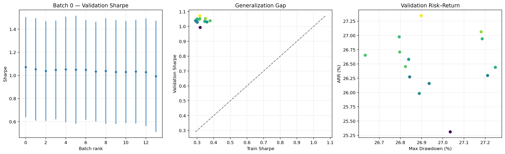
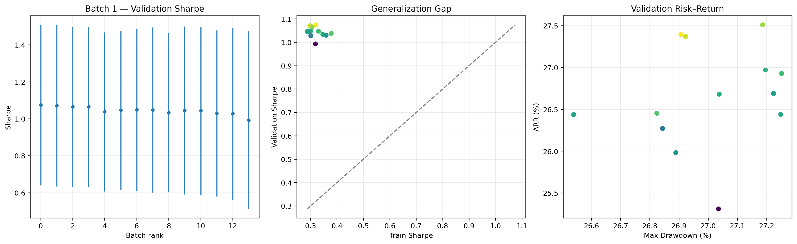
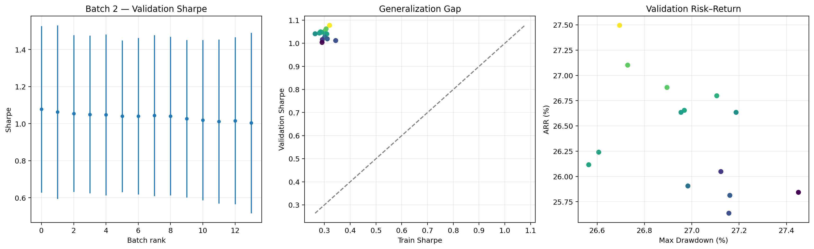
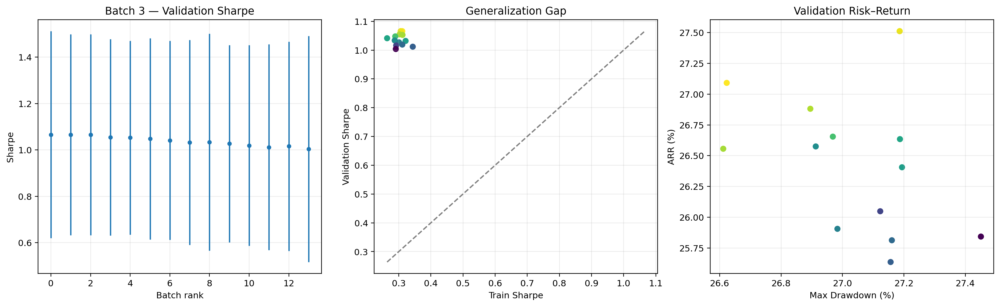

# Báo cáo tổng hợp kết quả UCB — Batch 0, 1, 2 và 3

## 1. Phạm vi đánh giá

Báo cáo tổng hợp kết quả tuning UCB trong bốn thư mục `batch_0`, `batch_1`, `batch_2` và `batch_3`.

- Tổng số cấu hình UCB: **56** (14 cấu hình/batch).
- Mỗi cấu hình chạy trên đủ 3 seed: **42, 43, 44**.
- Tổng số lượt chạy: **168**.
- Cả 56/56 cấu hình đều hoàn thành đủ 3 seed.
- Tất cả cấu hình có `finite_rate = 1.0`, không xuất hiện NaN/Inf.
- VAE được cố định theo cấu hình `vae_019` trong toàn bộ quá trình tuning UCB.

Cấu hình VAE cố định:

| Tham số | Giá trị |
|---|---:|
| `vae_latent_dim` | 16 |
| `vae_lr` | 0.0001 |
| `vae_beta_kl` | 0.05 |
| `vae_batch_size` | 256 |
| `bootstrap_trajectories` | 5 |
| `bootstrap_updates` | 100 |
| `online_aux_updates` | 1 |
| `vae_replay_capacity` | 50.000 |

Không gian tìm kiếm UCB:

- `beta_0`: 0.01, 0.03, 0.05, 0.10, 0.15, 0.30, 0.50.
- `beta_decay`: 0.90, 0.93, 0.96, 0.99.
- `beta_min`: 0.005, 0.01.

## 2. Nguyên tắc chọn top 5 trên cả ba seed

Top 5 trong báo cáo **không được chọn từ một seed riêng lẻ**. Một cấu hình chỉ đủ điều kiện xếp hạng khi:

1. Có đủ ba kết quả tương ứng với seed 42, 43 và 44.
2. Cả ba lượt chạy đều hữu hạn (`finite = True`).
3. Score được tính từ các thống kê gộp của cả ba seed, bao gồm trung bình và độ lệch chuẩn.

Công thức score chính thức:

```text
score = val_sharpe_mean
        - 0.25 × val_sharpe_std
        + 0.02 × val_arr_mean
        - 0.01 × val_mdd_mean
        - 0.20 × |gap_sharpe_mean|
        - 0.002 × |gap_arr_mean|
        - 0.02 × val_violations_mean
```

Công thức này ưu tiên Sharpe và ARR validation cao, đồng thời phạt độ biến động giữa các seed, drawdown, generalization gap và violations. Vì vậy, cấu hình có một seed đặc biệt tốt nhưng hai seed còn lại yếu sẽ bị giảm điểm qua giá trị trung bình và `val_sharpe_std`.

## 3. Kết quả nổi bật của từng batch

| Batch | Hạng | Cấu hình | `beta_0` | `beta_decay` | `beta_min` | Score | Val. Sharpe | Sharpe std | Val. ARR | Val. MDD |
|---:|---:|---|---:|---:|---:|---:|---:|---:|---:|---:|
| 0 | 1 | `ucb_008` | 0.03 | 0.90 | 0.005 | **0.986026** | 1.0724 | 0.4322 | 27.35 | 26.90 |
| 0 | 2 | `ucb_032` | 0.15 | 0.90 | 0.005 | 0.968032 | 1.0530 | 0.4425 | 27.06 | 27.18 |
| 0 | 3 | `ucb_028` | 0.10 | 0.96 | 0.005 | 0.957459 | 1.0380 | 0.4306 | 26.45 | 26.82 |
| 1 | 1 | `ucb_009` | 0.03 | 0.90 | 0.010 | **0.988685** | 1.0745 | 0.4341 | 27.40 | 26.91 |
| 1 | 2 | `ucb_041` | 0.30 | 0.90 | 0.010 | 0.979686 | 1.0708 | 0.4363 | 27.37 | 26.92 |
| 1 | 3 | `ucb_005` | 0.01 | 0.96 | 0.010 | 0.971264 | 1.0656 | 0.4332 | 27.51 | 27.19 |
| 2 | 1 | `ucb_002` | 0.01 | 0.93 | 0.005 | **0.991162** | 1.0776 | 0.4493 | 27.50 | 26.70 |
| 2 | 2 | `ucb_026` | 0.10 | 0.93 | 0.005 | 0.964114 | 1.0626 | 0.4681 | 27.10 | 26.73 |
| 2 | 3 | `ucb_042` | 0.30 | 0.93 | 0.005 | 0.962717 | 1.0547 | 0.4233 | 26.88 | 26.90 |
| 3 | 1 | `ucb_027` | 0.10 | 0.93 | 0.010 | **0.973958** | 1.0658 | 0.4461 | 27.09 | 26.62 |
| 3 | 2 | `ucb_003` | 0.01 | 0.93 | 0.010 | 0.971264 | 1.0656 | 0.4332 | 27.51 | 27.19 |
| 3 | 3 | `ucb_007` | 0.01 | 0.99 | 0.010 | 0.971264 | 1.0656 | 0.4332 | 27.51 | 27.19 |

## 4. Biểu đồ chẩn đoán theo batch



*Hình 1. Batch 0: Validation Sharpe, generalization gap và tương quan rủi ro–lợi nhuận.*



*Hình 2. Batch 1: Validation Sharpe, generalization gap và tương quan rủi ro–lợi nhuận.*



*Hình 3. Batch 2: Validation Sharpe, generalization gap và tương quan rủi ro–lợi nhuận.*



*Hình 4. Batch 3: Validation Sharpe, generalization gap và tương quan rủi ro–lợi nhuận.*

## 5. Top 5 cấu hình mạnh nhất trên cả ba seed

| Hạng | Cấu hình | Batch | `beta_0` | `beta_decay` | `beta_min` | Score | Val. Sharpe | Sharpe std | Val. ARR | Val. MDD | Gap Sharpe |
|---:|---|---:|---:|---:|---:|---:|---:|---:|---:|---:|---:|
| **1** | **`ucb_002`** | 2 | **0.01** | **0.93** | **0.005** | **0.991162** | **1.0776** | 0.4493 | **27.50** | 26.70 | -0.7577 |
| **2** | **`ucb_009`** | 1 | **0.03** | **0.90** | **0.010** | **0.988685** | 1.0745 | 0.4341 | 27.40 | 26.91 | -0.7537 |
| **3** | **`ucb_008`** | 0 | **0.03** | **0.90** | **0.005** | **0.986026** | 1.0724 | **0.4322** | 27.35 | 26.90 | -0.7548 |
| **4** | **`ucb_041`** | 1 | **0.30** | **0.90** | **0.010** | **0.979686** | 1.0708 | 0.4363 | 27.37 | 26.92 | -0.7729 |
| **5** | **`ucb_027`** | 3 | **0.10** | **0.93** | **0.010** | **0.973958** | 1.0658 | 0.4461 | 27.09 | **26.62** | -0.7548 |

Cả năm cấu hình đều có `seeds = 3`, `finite_rate = 1.0` và `val_violations_mean = 3.33`. Thứ hạng trên là thứ hạng toàn cục sau khi gộp 56 cấu hình từ cả bốn batch.

## 6. Kiểm chứng top 5 theo từng seed

### Validation Sharpe

| Cấu hình | Seed 42 | Seed 43 | Seed 44 | Trung bình | Độ lệch chuẩn | Sharpe thấp nhất |
|---|---:|---:|---:|---:|---:|---:|
| `ucb_002` | 0.5589 | **1.3332** | **1.3409** | **1.0776** | 0.4493 | 0.5589 |
| `ucb_009` | 0.5736 | 1.3090 | **1.3409** | 1.0745 | 0.4341 | 0.5736 |
| `ucb_008` | **0.5738** | 1.3024 | **1.3409** | 1.0724 | **0.4322** | **0.5738** |
| `ucb_041` | 0.5674 | 1.3070 | 1.3380 | 1.0708 | 0.4363 | 0.5674 |
| `ucb_027` | 0.5511 | 1.3053 | **1.3409** | 1.0658 | 0.4461 | 0.5511 |

`ucb_002` có Sharpe trung bình cao nhất. `ucb_008` có **worst-seed Sharpe** (giá trị Sharpe thấp nhất trong ba seed) cao nhất trong top 5 và độ lệch chuẩn thấp nhất, nên là ứng viên thiên về tính vững hơn.

### Toàn bộ chỉ số validation theo seed

| Cấu hình | Seed | Val. ROI | Val. ARR | Val. Sharpe | Val. MDD | Violations | Finite |
|---|---:|---:|---:|---:|---:|---:|---|
| `ucb_002` | 42 | 31.05 | 9.45 | 0.5589 | 22.40 | 0 | True |
| `ucb_002` | 43 | 96.87 | 25.38 | 1.3332 | 19.33 | 0 | True |
| `ucb_002` | 44 | 221.35 | 47.66 | 1.3409 | 38.36 | 10 | True |
| `ucb_009` | 42 | 31.15 | 9.48 | 0.5736 | 22.39 | 0 | True |
| `ucb_009` | 43 | 95.35 | 25.05 | 1.3090 | 19.98 | 0 | True |
| `ucb_009` | 44 | 221.35 | 47.66 | 1.3409 | 38.36 | 10 | True |
| `ucb_008` | 42 | 31.13 | 9.47 | 0.5738 | 22.39 | 0 | True |
| `ucb_008` | 43 | 94.66 | 24.91 | 1.3024 | 19.95 | 0 | True |
| `ucb_008` | 44 | 221.35 | 47.66 | 1.3409 | 38.36 | 10 | True |
| `ucb_041` | 42 | 30.78 | 9.37 | 0.5674 | 22.44 | 0 | True |
| `ucb_041` | 43 | 96.52 | 25.30 | 1.3070 | 19.97 | 0 | True |
| `ucb_041` | 44 | 219.93 | 47.44 | 1.3380 | 38.36 | 10 | True |
| `ucb_027` | 42 | 30.20 | 9.21 | 0.5511 | 22.15 | 0 | True |
| `ucb_027` | 43 | 92.32 | 24.40 | 1.3053 | 19.36 | 0 | True |
| `ucb_027` | 44 | 221.35 | 47.66 | 1.3409 | 38.36 | 10 | True |

Kết quả cho thấy cả năm cấu hình đều có cùng xu hướng: seed 42 là kịch bản yếu nhất, seed 43 tốt hơn rõ rệt và seed 44 có lợi nhuận cao nhất nhưng đi kèm MDD 38,36 và 10 violations. Do đó, báo cáo không xem kết quả seed 44 là đủ để kết luận một cấu hình mạnh; thứ hạng luôn dựa trên tổng hợp cả ba seed.

## 7. Ảnh hưởng của các tham số UCB

### `beta_0`

| `beta_0` | Số cấu hình | Score trung bình | Score tốt nhất | Sharpe trung bình | ARR trung bình |
|---:|---:|---:|---:|---:|---:|
| **0.01** | 8 | **0.9662** | **0.9912** | **1.0601** | **27.14** |
| 0.03 | 8 | 0.9460 | 0.9887 | 1.0450 | 26.57 |
| 0.05 | 8 | 0.9374 | 0.9462 | 1.0397 | 26.44 |
| 0.10 | 8 | 0.9529 | 0.9740 | 1.0478 | 26.78 |
| 0.15 | 8 | 0.9379 | 0.9680 | 1.0368 | 26.46 |
| 0.30 | 8 | 0.9399 | 0.9797 | 1.0405 | 26.54 |
| 0.50 | 8 | 0.8978 | 0.9373 | 1.0118 | 25.82 |

`beta_0 = 0.01` tốt nhất khi xét trung bình. `beta_0 = 0.50` cho kết quả kém nhất, cho thấy mức khám phá ban đầu quá cao không phù hợp với thí nghiệm này.

### `beta_decay`

| `beta_decay` | Số cấu hình | Score trung bình | Score tốt nhất | Sharpe trung bình | ARR trung bình |
|---:|---:|---:|---:|---:|---:|
| **0.90** | 14 | **0.9558** | 0.9887 | **1.0529** | **26.94** |
| 0.93 | 14 | 0.9499 | **0.9912** | 1.0469 | 26.67 |
| 0.96 | 14 | 0.9319 | 0.9713 | 1.0315 | 26.28 |
| 0.99 | 14 | 0.9214 | 0.9713 | 1.0297 | 26.25 |

Decay 0.90 tốt nhất theo trung bình, trong khi cấu hình đơn lẻ tốt nhất dùng decay 0.93. Các decay chậm 0.96–0.99 nhìn chung yếu hơn.

### `beta_min`

| `beta_min` | Số cấu hình | Score trung bình | Score tốt nhất | Sharpe trung bình | ARR trung bình |
|---:|---:|---:|---:|---:|---:|
| 0.005 | 28 | 0.9382 | **0.9912** | 1.0387 | 26.46 |
| **0.010** | 28 | **0.9413** | 0.9887 | **1.0418** | **26.61** |

Hai mức `beta_min` khá sát nhau. Mức 0.01 tốt hơn nhẹ theo trung bình, còn 0.005 tạo ra cấu hình đứng đầu toàn cục.

## 8. Kết luận lựa chọn

Top 5 cấu hình UCB được đề xuất để đưa sang vòng xác nhận tiếp theo:

1. **`ucb_002`** — `beta_0 = 0.01`, `beta_decay = 0.93`, `beta_min = 0.005`.
2. **`ucb_009`** — `beta_0 = 0.03`, `beta_decay = 0.90`, `beta_min = 0.010`.
3. **`ucb_008`** — `beta_0 = 0.03`, `beta_decay = 0.90`, `beta_min = 0.005`.
4. **`ucb_041`** — `beta_0 = 0.30`, `beta_decay = 0.90`, `beta_min = 0.010`.
5. **`ucb_027`** — `beta_0 = 0.10`, `beta_decay = 0.93`, `beta_min = 0.010`.

**Lựa chọn chính theo score tổng hợp là `ucb_002`.** Cấu hình này đạt score, Validation Sharpe trung bình và ARR trung bình cao nhất trong 56 cấu hình, đồng thời có MDD trung bình thấp thứ hai trong top 5.

**Lựa chọn thiên về độ vững là `ucb_008`.** Cấu hình này đứng thứ ba theo score nhưng có worst-seed Sharpe cao nhất và Sharpe std thấp nhất trong top 5.

Do độ khác biệt lớn giữa seed 42 và seed 44, chưa nên khóa UCB cuối cùng chỉ từ ba seed screening. Nên chạy lại năm cấu hình trên với nhiều seed hơn hoặc trên tập test hoàn toàn chưa tham gia tuning; việc đánh giá cuối cùng cần tiếp tục theo dõi MDD và violations bên cạnh Sharpe/ARR.

## 9. Nguồn dữ liệu

- `batch_0/tim_tham_so_ucb_batch0.csv`
- `batch_0/tim_tham_so_ucb_batch0_leaderboard.csv`
- `batch_0/tim_tham_so_ucb_batch0_summary.json`
- `batch_1/tim_tham_so_ucb_batch1.csv`
- `batch_1/tim_tham_so_ucb_batch1_leaderboard.csv`
- `batch_1/tim_tham_so_ucb_batch1_summary.json`
- `batch_2/tim_tham_so_ucb_batch2.csv`
- `batch_2/tim_tham_so_ucb_batch2_leaderboard.csv`
- `batch_2/tim_tham_so_ucb_batch2_summary.json`
- `batch_3/tim_tham_so_ucb_batch3.csv`
- `batch_3/tim_tham_so_ucb_batch3_leaderboard.csv`
- `batch_3/tim_tham_so_ucb_batch3_summary.json`
