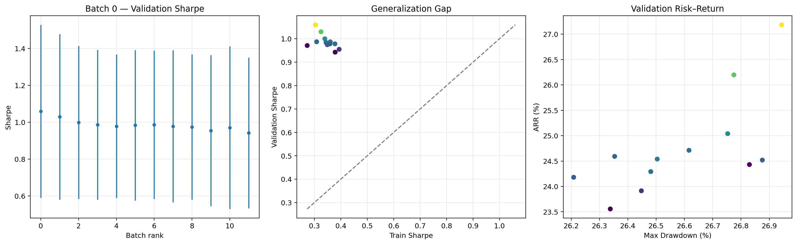
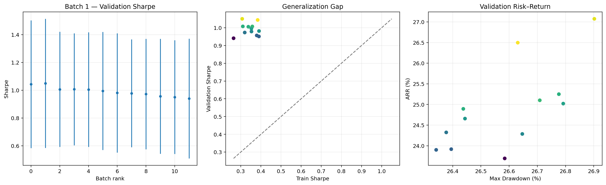
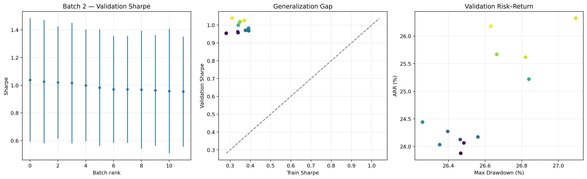
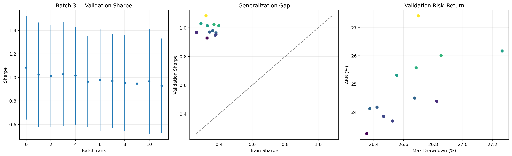

# Báo cáo kết quả lựa chọn VAE — Batch 0, 1, 2 và 3

## 1. Phạm vi báo cáo

Báo cáo này tổng hợp kết quả tìm siêu tham số VAE từ bốn thư mục `batch_0`, `batch_1`, `batch_2` và `batch_3`.

- Tổng số cấu hình: **48** (12 cấu hình/batch).
- Mỗi cấu hình được đánh giá trên 3 seed: **42, 43, 44**.
- Tổng số lượt chạy: **144**.
- Cả 48/48 cấu hình đều hoàn thành đủ 3 seed và có `finite_rate = 1.0`.
- Mô hình nền: **Uncertainty-Aware UCB-VAE**.

Các tham số giữ cố định trong bốn batch:

| Tham số | Giá trị |
|---|---:|
| `vae_batch_size` | 256 |
| `bootstrap_trajectories` | 5 |
| `bootstrap_updates` | 100 |
| `online_aux_updates` | 1 |
| `vae_replay_capacity` | 50.000 |

Các tham số được khảo sát gồm:

- `vae_latent_dim`: 8, 16, 32.
- `vae_lr`: 0.0001, 0.0003, 0.001, 0.003.
- `vae_beta_kl`: 0.0001 ở batch 0; 0.001 ở batch 1; 0.01 ở batch 2; 0.05 ở batch 3.

## 2. Tiêu chí xếp hạng

Score trong các leaderboard được tính theo công thức:

```text
score = val_sharpe_mean
        - 0.25 × val_sharpe_std
        + 0.02 × val_arr_mean
        - 0.01 × val_mdd_mean
        - 0.20 × |gap_sharpe_mean|
        - 0.002 × |gap_arr_mean|
        - 0.02 × val_violations_mean
```

Do đó, score không chỉ ưu tiên Sharpe và ARR cao mà còn phạt biến động giữa các seed, drawdown, vi phạm ràng buộc và khoảng cách train–validation. Cấu hình thiếu seed hoặc phát sinh giá trị không hữu hạn sẽ bị loại bằng score âm vô cùng.

## 3. Kết quả tốt nhất của từng batch

### Batch 0 — `vae_beta_kl = 0.0001`

| Hạng | Cấu hình | Latent | LR | Score | Val. Sharpe | Sharpe std | Val. ARR | Val. MDD | Gap Sharpe |
|---:|---|---:|---:|---:|---:|---:|---:|---:|---:|
| 1 | `vae_016` | 16 | 0.0001 | **0.960019** | **1.0593** | 0.4691 | **27.18** | 26.94 | -0.7547 |
| 2 | `vae_020` | 16 | 0.0003 | 0.930114 | 1.0297 | 0.4489 | 26.20 | 26.77 | -0.7045 |
| 3 | `vae_036` | 32 | 0.0003 | 0.897960 | 0.9996 | 0.4148 | 25.04 | 26.75 | -0.6599 |

`vae_016` dẫn đầu batch 0 nhờ Sharpe và ARR validation cao nhất, dù độ lệch chuẩn Sharpe và generalization gap còn lớn.



*Hình 1. Kết quả Batch 0: Validation Sharpe theo thứ hạng, khoảng cách khái quát hóa giữa train và validation, và tương quan rủi ro–lợi nhuận trên tập validation.*

### Batch 1 — `vae_beta_kl = 0.001`

| Hạng | Cấu hình | Latent | LR | Score | Val. Sharpe | Sharpe std | Val. ARR | Val. MDD | Gap Sharpe |
|---:|---|---:|---:|---:|---:|---:|---:|---:|---:|
| 1 | `vae_021` | 16 | 0.0003 | **0.958877** | 1.0436 | 0.4595 | 26.50 | **26.63** | **-0.6594** |
| 2 | `vae_017` | 16 | 0.0001 | 0.952807 | **1.0500** | 0.4646 | **27.07** | 26.90 | -0.7427 |
| 3 | `vae_041` | 32 | 0.0010 | 0.909172 | 1.0072 | 0.4147 | 25.10 | 26.71 | -0.6496 |

`vae_021` có sự cân bằng tốt hơn `vae_017`: lợi nhuận điều chỉnh rủi ro thấp hơn một ít nhưng MDD và generalization gap tốt hơn, nhờ đó đứng đầu batch 1.



*Hình 2. Kết quả Batch 1: Validation Sharpe theo thứ hạng, khoảng cách khái quát hóa giữa train và validation, và tương quan rủi ro–lợi nhuận trên tập validation.*

### Batch 2 — `vae_beta_kl = 0.01`

| Hạng | Cấu hình | Latent | LR | Score | Val. Sharpe | Sharpe std | Val. ARR | Val. MDD | Gap Sharpe |
|---:|---|---:|---:|---:|---:|---:|---:|---:|---:|
| 1 | `vae_018` | 16 | 0.0001 | **0.935440** | **1.0385** | 0.4463 | 26.18 | **26.63** | -0.7285 |
| 2 | `vae_022` | 16 | 0.0003 | 0.930821 | 1.0263 | 0.4453 | **26.32** | 27.09 | **-0.6565** |
| 3 | `vae_038` | 32 | 0.0003 | 0.928327 | 1.0198 | **0.4056** | 25.62 | 26.82 | -0.6697 |

`vae_018` đứng đầu batch 2. Tuy nhiên, score tối đa của batch này thấp hơn hai batch còn lại.



*Hình 3. Kết quả Batch 2: Validation Sharpe theo thứ hạng, khoảng cách khái quát hóa giữa train và validation, và tương quan rủi ro–lợi nhuận trên tập validation.*

### Batch 3 — `vae_beta_kl = 0.05`

| Hạng | Cấu hình | Latent | LR | Score | Val. Sharpe | Sharpe std | Val. ARR | Val. MDD | Gap Sharpe |
|---:|---|---:|---:|---:|---:|---:|---:|---:|---:|
| 1 | `vae_019` | 16 | 0.0001 | **0.995777** | **1.0825** | 0.4407 | **27.42** | 26.70 | -0.7621 |
| 2 | `vae_031` | 16 | 0.0030 | 0.932629 | 1.0236 | 0.4438 | 26.00 | 26.85 | -0.6549 |
| 3 | `vae_027` | 16 | 0.0010 | 0.927517 | 1.0142 | **0.4334** | 25.57 | **26.69** | **-0.6162** |

`vae_019` đứng đầu batch 3 với khoảng cách score rõ rệt so với hai cấu hình tiếp theo. Đây cũng là cấu hình có Validation Sharpe và Validation ARR cao nhất trong cả bốn batch.



*Hình 4. Kết quả Batch 3: Validation Sharpe theo thứ hạng, khoảng cách khái quát hóa giữa train và validation, và tương quan rủi ro–lợi nhuận trên tập validation.*

## 4. Xếp hạng chung giữa bốn batch

| Hạng chung | Batch | Cấu hình | Latent | LR | Beta KL | Score | Val. Sharpe | Val. ARR | Val. MDD |
|---:|---:|---|---:|---:|---:|---:|---:|---:|---:|
| 1 | 3 | `vae_019` | 16 | 0.0001 | 0.0500 | **0.995777** | **1.0825** | **27.42** | 26.70 |
| 2 | 0 | `vae_016` | 16 | 0.0001 | 0.0001 | 0.960019 | 1.0593 | 27.18 | 26.94 |
| 3 | 1 | `vae_021` | 16 | 0.0003 | 0.0010 | 0.958877 | 1.0436 | 26.50 | **26.63** |
| 4 | 1 | `vae_017` | 16 | 0.0001 | 0.0010 | 0.952807 | 1.0500 | 27.07 | 26.90 |
| 5 | 2 | `vae_018` | 16 | 0.0001 | 0.0100 | 0.935440 | 1.0385 | 26.18 | **26.63** |
| 6 | 3 | `vae_031` | 16 | 0.0030 | 0.0500 | 0.932629 | 1.0236 | 26.00 | 26.85 |
| 7 | 2 | `vae_022` | 16 | 0.0003 | 0.0100 | 0.930821 | 1.0263 | 26.32 | 27.09 |
| 8 | 0 | `vae_020` | 16 | 0.0003 | 0.0001 | 0.930114 | 1.0297 | 26.20 | 26.77 |
| 9 | 2 | `vae_038` | 32 | 0.0003 | 0.0100 | 0.928327 | 1.0198 | 25.62 | 26.82 |
| 10 | 3 | `vae_027` | 16 | 0.0010 | 0.0500 | 0.927517 | 1.0142 | 25.57 | 26.69 |

## 5. Ảnh hưởng của siêu tham số

### Kích thước latent

| Latent dim | Số cấu hình | Score trung bình | Score tốt nhất | Sharpe trung bình | ARR trung bình |
|---:|---:|---:|---:|---:|---:|
| 8 | 16 | 0.8618 | 0.8877 | 0.9626 | 24.05 |
| **16** | 16 | **0.9261** | **0.9958** | **1.0229** | **25.91** |
| 32 | 16 | 0.8734 | 0.9283 | 0.9816 | 24.55 |

`latent_dim = 16` cho kết quả tốt và nhất quán nhất. Latent 8 có vẻ thiếu khả năng biểu diễn, còn latent 32 không tạo ra lợi ích đủ lớn để bù độ phức tạp tăng thêm.

### Learning rate

| Learning rate | Số cấu hình | Score trung bình | Score tốt nhất | Sharpe trung bình | ARR trung bình |
|---:|---:|---:|---:|---:|---:|
| 0.0001 | 12 | 0.8791 | **0.9958** | 0.9888 | 24.93 |
| **0.0003** | 12 | **0.9009** | 0.9589 | **0.9990** | **25.15** |
| 0.0010 | 12 | 0.8849 | 0.9275 | 0.9845 | 24.63 |
| 0.0030 | 12 | 0.8834 | 0.9326 | 0.9839 | 24.64 |

Xét trung bình toàn bộ không gian tìm kiếm, `lr = 0.0003` tốt nhất. Tuy vậy, cấu hình đơn lẻ tốt nhất dùng `lr = 0.0001`, cho thấy LR tối ưu còn tương tác với latent dim và beta KL.

### Trọng số KL

| Beta KL | Batch | Score trung bình | Score tốt nhất | Sharpe trung bình | ARR trung bình |
|---:|---:|---:|---:|---:|---:|
| 0.0001 | 0 | 0.8842 | 0.9600 | 0.9871 | 24.76 |
| **0.0010** | 1 | **0.8892** | 0.9589 | **0.9908** | **24.88** |
| 0.0100 | 2 | 0.8880 | 0.9354 | 0.9889 | 24.83 |
| 0.0500 | 3 | 0.8869 | **0.9958** | 0.9893 | 24.87 |

`beta_kl = 0.001` vẫn tốt nhất nếu xét trung bình 12 cấu hình, nhưng `beta_kl = 0.05` tạo ra cấu hình riêng lẻ có score cao nhất. Chênh lệch trung bình giữa bốn mức beta khá nhỏ, cho thấy hiệu quả phụ thuộc mạnh vào tương tác giữa beta KL, latent dim và learning rate hơn là chỉ riêng beta KL.

## 6. Cấu hình VAE được lựa chọn

### Lựa chọn chính: `vae_019`

| Tham số | Giá trị |
|---|---:|
| `vae_latent_dim` | **16** |
| `vae_lr` | **0.0001** |
| `vae_beta_kl` | **0.05** |
| `vae_batch_size` | 256 |
| `bootstrap_trajectories` | 5 |
| `bootstrap_updates` | 100 |
| `online_aux_updates` | 1 |
| `vae_replay_capacity` | 50.000 |

Các chỉ số trung bình của `vae_019` trên 3 seed:

| Chỉ số | Giá trị |
|---|---:|
| Score | **0.995777** |
| Validation profit | 1.160,49 |
| Validation ROI | 116,05 |
| Validation ARR | **27,42** |
| Validation Sharpe | **1,0825** |
| Độ lệch chuẩn Validation Sharpe | 0,4407 |
| Validation MDD | 26,70 |
| Validation violations | 3,33 |
| Train Sharpe | 0,3204 |
| Gap Sharpe | -0,7621 |
| Gap ARR | -19,42 |
| VAE loss cuối | 0,2426 |
| Novelty mean | 6,3263 |
| Finite rate | 1,0 |

Lý do chọn:

1. `vae_019` có **score cao nhất trong cả 48 cấu hình** sau khi đã tính các khoản phạt rủi ro, phương sai và generalization gap.
2. Cấu hình này đồng thời đạt **Validation Sharpe trung bình cao nhất (1,0825)** và **Validation ARR trung bình cao nhất (27,42)** trong nhóm được khảo sát.
3. `latent_dim = 16` là mức latent tốt nhất cả về score, Sharpe và ARR trung bình.
4. Cả 3/3 seed đều chạy hoàn chỉnh, không có giá trị NaN/Inf (`finite_rate = 1.0`).
5. So với lựa chọn cũ `vae_016`, `vae_019` có Sharpe cao hơn, ARR cao hơn, MDD thấp hơn và độ lệch chuẩn Sharpe thấp hơn.

### Kết quả của `vae_019` theo từng seed

| Seed | Val. ROI | Val. ARR | Val. Sharpe | Val. MDD | Violations | VAE loss cuối |
|---:|---:|---:|---:|---:|---:|---:|
| 42 | 31,15 | 9,48 | 0,5736 | 22,39 | 0 | 0,1678 |
| 43 | 95,64 | 25,12 | 1,3331 | 19,35 | 0 | 0,1619 |
| 44 | 221,35 | 47,66 | 1,3409 | 38,36 | 10 | 0,3981 |

Kết quả vẫn thay đổi đáng kể giữa các seed. Seed 44 mang lại lợi nhuận cao nhất nhưng cũng có drawdown và số vi phạm lớn nhất; seed 42 thấp hơn rõ rệt về Sharpe và ARR. Vì vậy, `vae_019` là lựa chọn tốt nhất **trong phạm vi thí nghiệm hiện tại**, nhưng chưa nên xem là bằng chứng về độ ổn định tuyệt đối.

### Các phương án dự phòng

`vae_016` đứng thứ hai với score 0,960019, kém `vae_019` 0,035757 điểm. Hai cấu hình dùng cùng `latent_dim = 16` và `lr = 0.0001`, chỉ khác beta KL. So với `vae_016`, `vae_019` có:

- Score cao hơn: 0,995777 so với 0,960019.
- Validation Sharpe cao hơn: 1,0825 so với 1,0593.
- Validation ARR cao hơn: 27,42 so với 27,18.
- Sharpe std thấp hơn: 0,4407 so với 0,4691.
- MDD thấp hơn: 26,70 so với 26,94.

`vae_021` đứng thứ ba với score 0,958877 nhưng có generalization gap tốt hơn `vae_019`: `|gap_sharpe| = 0,6594` so với 0,7621 và `|gap_arr| = 17,47` so với 19,42. Nếu kiểm thử ngoài mẫu ưu tiên khả năng khái quát hóa hơn hiệu suất validation hiện tại, nên giữ `vae_021` (`latent_dim = 16`, `lr = 0.0003`, `beta_kl = 0.001`) làm phương án đối chứng.

## 7. Kết luận và khuyến nghị

**Cấu hình được chọn lại là `vae_019`: `latent_dim = 16`, `lr = 0.0001`, `beta_kl = 0.05`.** Đây là cấu hình có score, Validation Sharpe và Validation ARR cao nhất trong 48 cấu hình thuộc batch 0–3.

Trước khi chốt cho mô hình cuối cùng, nên thực hiện một vòng xác nhận với nhiều seed hơn và/hoặc một tập test hoàn toàn chưa dùng trong tuning. Vòng xác nhận nên so sánh trực tiếp `vae_019`, `vae_016` và `vae_021`, đồng thời theo dõi MDD và violations vì cả ba cấu hình vẫn nhạy theo seed và seed 44 có 10 vi phạm.

## 8. Nguồn dữ liệu

- `batch_0/tim_tham_so_vae_batch0_summary.json`
- `batch_0/tim_tham_so_vae_batch0_leaderboard.csv`
- `batch_0/tim_tham_so_vae_batch0.csv`
- `batch_1/tim_tham_so_vae_batch1_summary.json`
- `batch_1/tim_tham_so_vae_batch1_leaderboard.csv`
- `batch_1/tim_tham_so_vae_batch1.csv`
- `batch_2/tim_tham_so_vae_batch2_summary.json`
- `batch_2/tim_tham_so_vae_batch2_leaderboard.csv`
- `batch_2/tim_tham_so_vae_batch2.csv`
- `batch_3/tim_tham_so_vae_batch3_summary.json`
- `batch_3/tim_tham_so_vae_batch3_leaderboard.csv`
- `batch_3/tim_tham_so_vae_batch3.csv`
